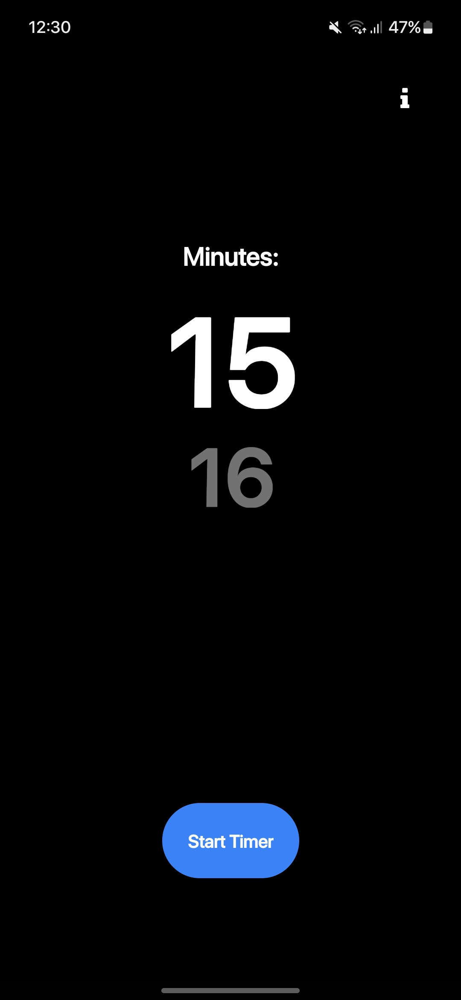
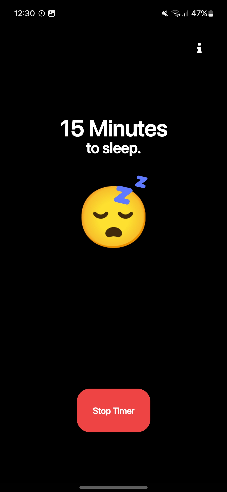
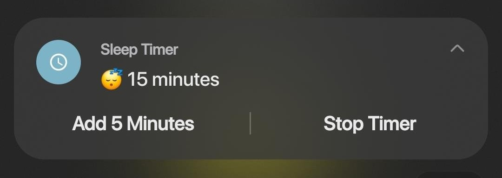

  <h2>Sleep Timer</h2>

Sleep Timer is a React Native mobile application that helps you set a timer to automatically stop media playback and create a silent environment for your sleep.

  <h2>Features</h2>

- **Media Control**: The app can automatically pause or stop any running media (music, podcasts, etc.) when the sleep timer is triggered.

- **Interactive Timer Selector**: Set your desired sleep duration with an interactive number slider, making it easy to customize the timer.

- **Widget Support**: Use the included widget to initiate the sleep timer directly from your device's home screen.

  
  

  <h2>Usage</h2>

- : Open the app and use the interactive slider to set your desired sleep duration.

- : Toggle the sleep timer to start or stop the countdown.

- : The app will automatically pause or stop any playing media when the timer reaches zero.

  <h2>Notifications</h2>

Sleep Timer provides notifications for easy access to timer controls even when the app is running in the background.

- **Add Five Minutes**: Extend your sleep timer on the go by tapping the "Add 5 Minutes" action directly from the notification.

- **Stop Timer**: Quickly stop the sleep timer by tapping the "Stop Timer" action directly from the notification.

  

  <h2>Widget</h2>

Sleep Timer comes with a handy widget that allows you to initiate and stop your sleep timer directly from your home screen.

  <h2>Contributing</h2>

Thank you for considering contributing to Sleep Timer! Contributions are highly appreciated.

  <h2>Reporting Issues</h2>

If you find any bugs, have feature requests, or encounter any issues, please open an issue on GitHub.

  <h2>Licanse</h2>

Sleep Timer is open source and available under the MIT License.
